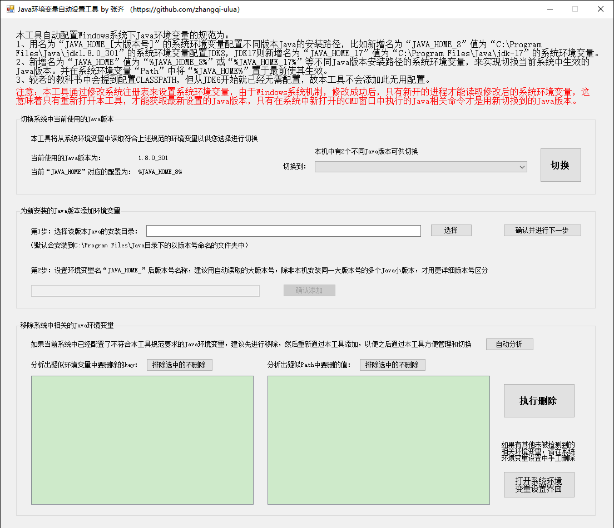
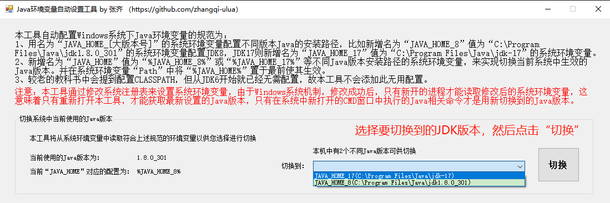
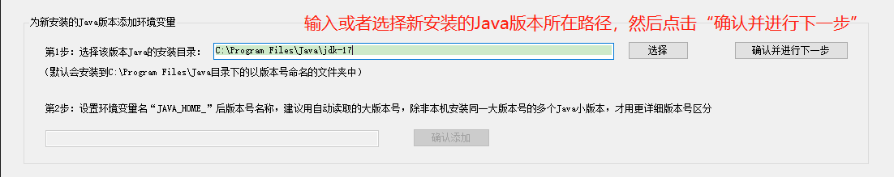
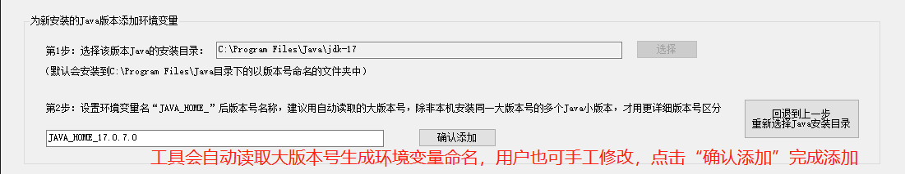
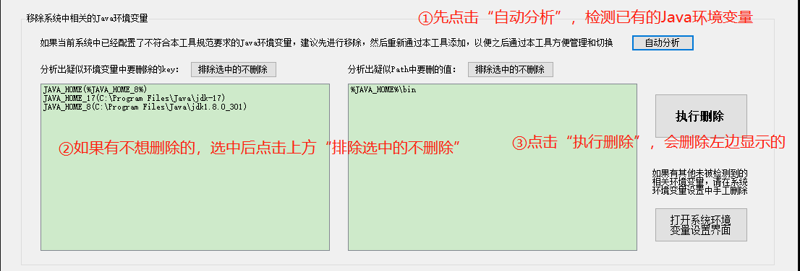

# JavaEnvironmentVariablesManager
Java环境变量自动设置工具，适用于新安装Java后一键配置环境变量，以及电脑中多个Java版本，需要经常切换

## 开发及运行说明

本工具使用C#编程语言，基于.NET Framework 4.8开发 
运行本工具需要在Windows系统中安装.NET Framework 4.X或者2.X的运行环境（一般Windows系统安装后自带，无需额外安装） 如果确实没有运行环境，可到微软官网下载：https://dotnet.microsoft.com/zh-cn/download/dotnet-framework/net48 ，打开网页后点击下载“运行应用 - 运行时” 
安装完运行环境后，双击打开“JavaEnvironmentVariablesManager.exe”，即可运行本工具，注意需要管理员权限运行

## 使用方法
### 主界面

 
### 切换系统中当前使用的Java版本

 
### 为新安装的Java版本添加环境变量

 

### 移除系统中相关的Java环境变量

 

## 赞助
如果您觉得软件还不错，并且愿意请作者喝杯咖啡的话，欢迎打赏 

